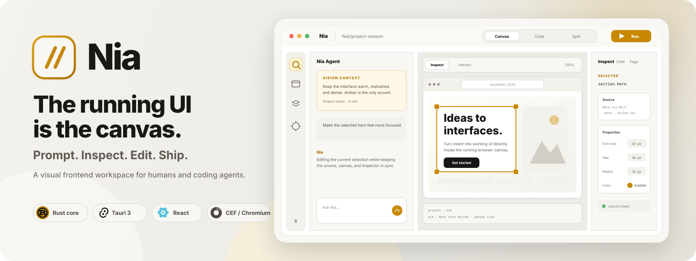

<p align="center">\n  \n</p>\n\n# Nia\n\nNia is a visual frontend engineering workspace for humans and coding agents.

The goal is simple: make frontend iteration feel immediate.

Nia combines a live Chromium canvas, source-aware inspection, direct visual editing, and an agent that works with the exact UI context you are looking at.

## Current status

This branch is an architecture spike for the desktop stack.

We are testing:

- Tauri 3
- the official CEF runtime
- Chromium rendering and DevTools Protocol access
- React and TypeScript for the interface
- Rust and Tokio for the local runtime
- low-latency IPC between the UI and Rust
- local Vite apps with HMR

The first milestone is not the full agent. It is proving that the browser canvas, Rust runtime, and source mapping path are solid enough to build on.

## Run

```bash
git pull
rm -rf node_modules pnpm-lock.yaml
pnpm install
pnpm tauri dev
```

## What we are proving first

1. Nia launches reliably with CEF on macOS.
2. The React interface stays responsive while Rust does background work.
3. Rust and frontend IPC stays fast.
4. A local Vite app can run inside the Chromium canvas path.
5. Nia can receive DevTools Protocol events from CEF.
6. A selected DOM node can resolve back to source code.
7. A source edit can trigger HMR and update the canvas quickly.

## Performance direction

Nia is latency-first.

Deterministic edits should happen locally without a model call. Dev servers should stay warm. Browser state should stay warm. Independent work should run in parallel. The agent should use small, high-signal context instead of repeatedly scanning the whole repository.

See `docs/PERFORMANCE.md` and `docs/SPIKE_CHECKLIST.md` for the current engineering targets.
